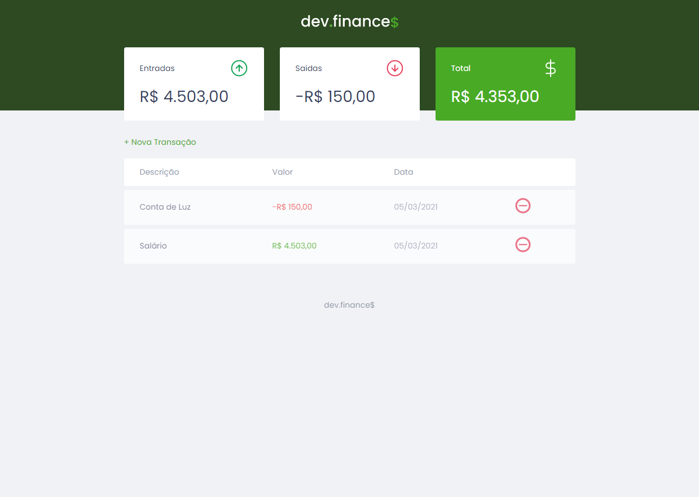

# Maratona Discovery
Esse projeto foi criado para acompanhar a maratona Discovery ministrada pelo Mayk Brito.

 
 

### Aulas da Maratona
- [x] [Discovery - Aula 01](https://www.youtube.com/watch?v=NlDr6JX3VvA&t&ab_channel=MaykBrito)
- [x] [Discovery - Aula 02](https://www.youtube.com/watch?v=f13z6eFJEQg&ab_channel=MaykBrito)
- [x] [Discovery - Aula 03](https://www.youtube.com/watch?v=41VftS_pjnI&&ab_channel=MaykBrito)
- [x] [Discovery - Aula 04](https://www.youtube.com/watch?v=Ia473nPz1L4&ab_channel=MaykBrito)

### <b>Opinião sobre a Maratona</b>
Essa maratona foi muito boa, logo de cara o Mayk já dá um choque de realidade em muitos Dev's que não estão entendo a situação atual do mercado e da sua própria carreira. Ele também dá dicas sobre os caminhos a seguir para quem está começando, fala sobre a Soft e Hard skills de um programador, além de como se organizar para estudar e trabalhar e mudar um pouco a mentalidade daqueles que não tem foco ou vontade.

Abordando o básico do conhecimento WEB, o Mayk conseguiu passar bastante conhecimento e que é usado em práticamente todos os projetos que envolva a WEB.

---
### <b>Opinião sobre o projeto</b>
Esse projeto criado pelo Mayk é muito bacana, cai um pouco no meu momento atual de vida que tenho que gerir minhas finanças pessoais. 

Fiquei inspirado com esse projeto, então   vou criar um outro repositório implementando esse projeto com ReactJS e NodeJs, fazer conexão com o MongoDB e criar uma aplicação mais robusta em cima dessa ideia de projeto.